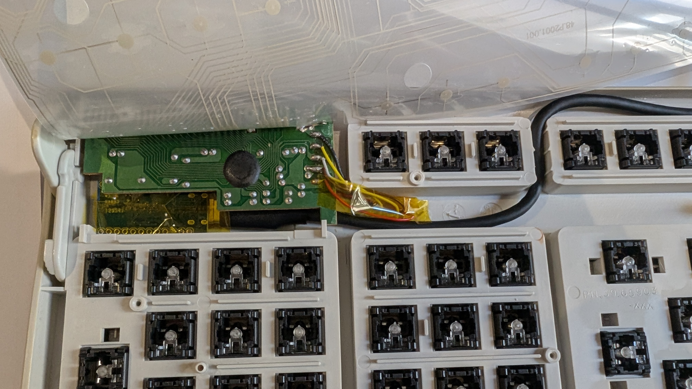
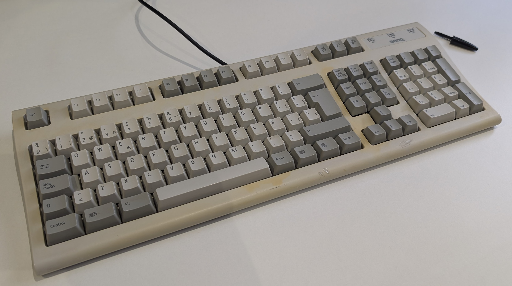

I've been tinkering with LLMs for a long time. I remember trying ChatGPT in 2023 and finding that it was a cool toy, but without much value for real usage. Then, I experienced a progression that many people had: it got better and I started using it to generate small code snippets, but nothing too fancy (mostly visualization code).  It got even better and started using it more and more, until November of 2025 where I tried claude code and was extremely surprised with the results. Since then, I've been using agents more and more up to the point that it has reshaped the way I work.

I consider myself pretty skeptical though, and I'm always asking myself whether using agents is valuable for my work or not. If you ask people and explore different forums you'll see that people either say that LLMs are the future and will take all of our jobs, or that LLMs are worthless and don't work at all. From what I have experienced, I think that current LLMs are an amazing tool, but it strongly depends on how and where you use it. For example, using LLMs to quickly vibe code your work might be a good idea at first, but in the long run it's typically not worth it. 

Instead, you can keep using LLMs but slow down (read [this post](https://mariozechner.at/posts/2026-03-25-thoughts-on-slowing-the-fuck-down/)) a little bit and try to understand what's going on and even learn new things during the process. One valid criticism of this approach is that it will take almost the same time as doing it manually. And I say this might be true  for things that you are really familiar with, but this changes when you are exploring less familiar territory.

What follows is hopefully an example of what I'm trying to convey. My brother gave me an old keyboard which came with an old PS/2 connection. I was curious about whether it would be possible to mod it and add a USB cable to it so I could use it with modern PCs. It turns out it was possible, and I was able to do it in a single morning with the help of LLMs:

I first started discussing the idea with ChatGPT: we identified the keyboard model and discussed the best way to perform the modification. Eventually, we decided that the best way would be to buy a small MCU and wire it up to the old controller, using it as a bridge between the old keyboard controller and the PC. GPT prepared a bill of materials, including the **ATmega32U4** processor that I got inexpensively on Aliexpress.

Once the materials arrived, the first thing to do was to open up the keyboard and identify the cables that were soldered to the old controller. I looked at the PSU diagram from wikipedia and with the help of the multimeter I identified what each cable was doing.



After that, I extracted the old controller and saw that the cables were labeled on the other side of the PCB and it matched my previous analysis. Now that the cables were identified, I just dropped the old PS/2 adapter and soldered the cables from the old to the new processor:

- `DATA` -> `D2`
- `CLOCK` -> `D3`
- `GND` -> `GND`
- `VCC` -> `VCC`



As you can see in the images there are two ground cables, but I left one disconnected and it worked out. After soldering, the next step was to actually flash the firmware that maps PS/2 to USB protocol.

Here is where things get interesting.

I opened up codex and described what I was trying to do. Then, codex did a quick diagnosis and told me to install some packages that were required to flash firmware. Once I installed the packages, I told codex to do a small test and in a few minutes I could see the LED flashing.

After seeing that the MCU was working, I closed the keyboard lid and asked codex to find already existing firmware to convert between protocols. It found out [this repo](https://github.com/tmk/tmk_keyboard/blob/master/converter/ps2_usb/README.md), cloned it, did a few modifications and flashed the firmware.

Initially, I thought that it was not working because pressing keys wouldn't do anything. But I saw that the Num Lock light was on, and when I pressed the Num Lock button on other keyboard, the light toggled on and off. Eventually I found out that it was my fault because I didn't tighten the lid enough. After tightening the screws, it worked perfectly! In fact, I'm typing with it right now:

And that's it! This may not be interesting for people that work with embedded systems, but I found it really cool to do a hardware project collaborating with an LLM agent. These sort of ideas are the ones that would have ended up in my increasing list of todos and eventually forgotten.

My point is that we shouldn't focus that much on discussing whether LLMs will eventually take our jobs or be useless, but to try working with what already exists and try building things and exploring. In other words, instead of focusing on whether LLMs improve or not, we are at a point where **how** we use them is becoming way more important: are you using them to get through your assignments quickly and passively? or are you using them to create? 
